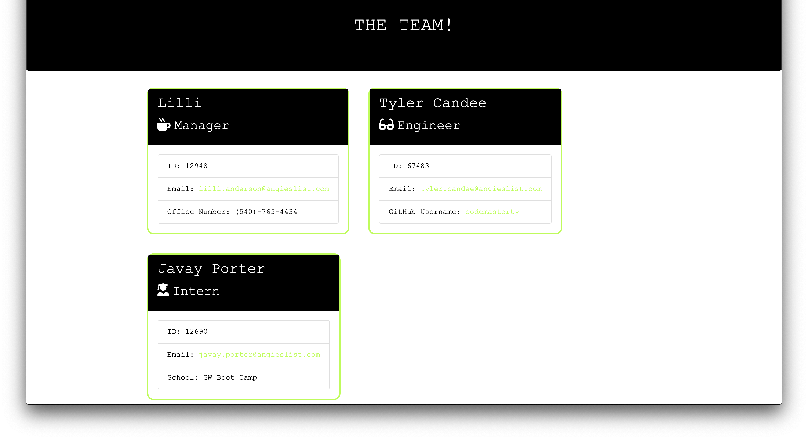
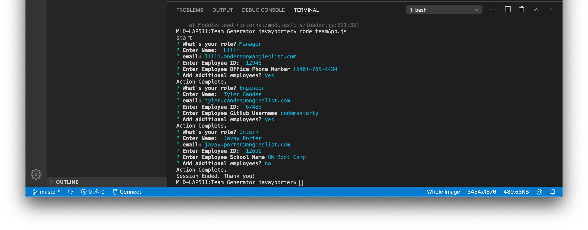

# Team_Generator

Team Generator is a software engineering team generator command line application. The application prompts the user for information about the team manager and then information about the team members. The user can input any number of team members, and they may be a mix of engineers and interns.

## User Story

As a manager
I want to generate a webpage that displays my team's basic info
so that I have quick access to emails and GitHub profiles

## Installation
Open Terminal to project directory
node teamApp.js

## App Screenshots

